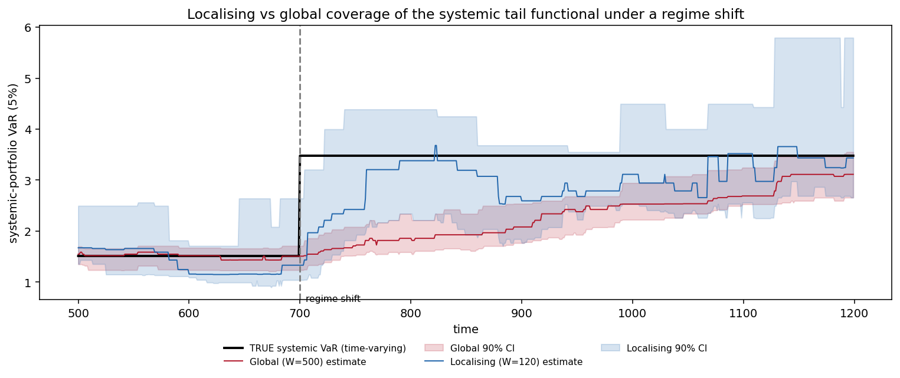

[](http://quantlet.de/)

##  **IDA_localising**

```yaml
Name of QuantLet: IDA_localising

Published in: Institute for Digital Assets (IDA)

Description: 'Controlled Monte-Carlo diagnostic (300 paths) showing that a localising
  (adaptive-window, Haerdle ICARE / Localizing-CAViaR style) estimator restores reliable
  coverage of a time-varying systemic tail functional under a regime shift, where a global
  stationary estimator does not. The functional is the 5% Value-at-Risk of the
  principal-eigenvector (systemic) portfolio of a 12-asset network; distribution-free
  order-statistic 90% confidence intervals are used. Under a volatility regime shift at
  t=700 the global estimator coverage collapses (about 92% to 33%) while the localising
  estimator holds near nominal (about 94% to 89%) and roughly halves RMSE - evidence for
  the L2 reliability mechanism (not the full high-dimensional theorem).'

Keywords: 'value-at-risk, systemic risk, tail risk, localising estimation, adaptive window,
  non-stationarity, regime shift, coverage, confidence interval, Monte-Carlo, CAViaR, ICARE'

Author: Daniel Traian Pele

Submitted: 25 June 2026

Output: 'o1_localising.png, o1_results.md'
```



### Reproduce

```bash
pip install -r requirements.txt
python o1_localising_sim.py
```

The simulation is fully self-contained (seeded RNG) and writes `o1_localising.png` (the figure
above) and `o1_results.md` (the coverage / RMSE table).
